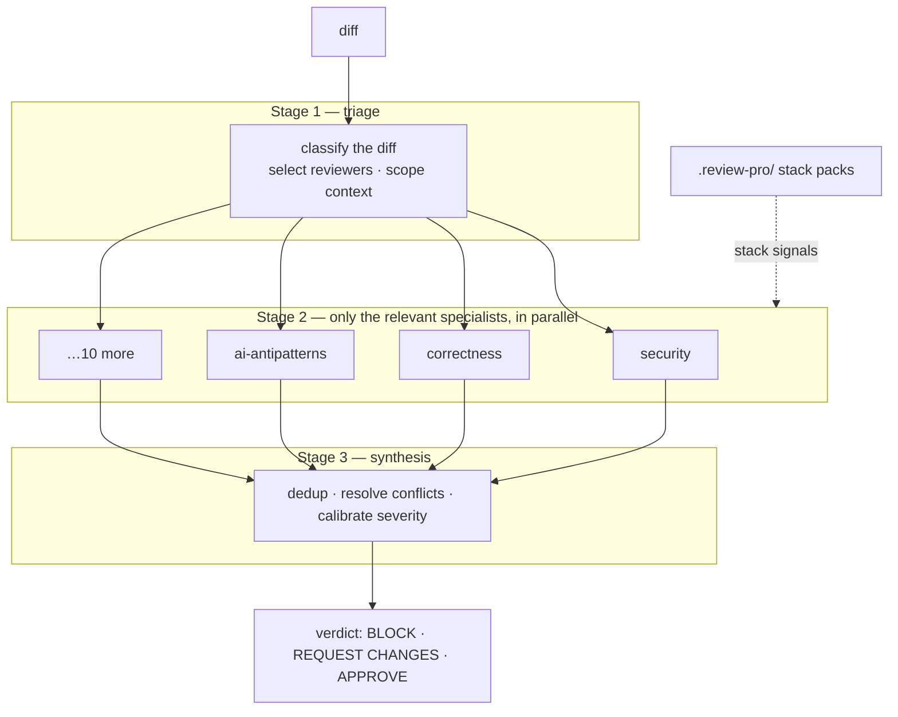

# review-pro

[](https://github.com/tufantunc/review-pro/actions/workflows/ci.yml)
[](https://www.npmjs.com/package/review-pro)
[](https://tufantunc.github.io/review-pro/)
[](LICENSE)
[](https://www.npmjs.com/package/review-pro)
[](#install-one-time)
[](https://scorecard.dev/viewer/?uri=github.com/tufantunc/review-pro)

**The diff is where the change is. The repository is where the evidence is.**

review-pro is an open-source, repository-aware code review system for coding agents — **Claude Code, opencode, Cursor, Codex**. Triage reads the diff and dispatches only the relevant specialists of thirteen; they run in parallel, each required to **locate evidence in the repository** before making a claim; synthesis dedups their findings into one verdict: **BLOCK / REQUEST CHANGES / APPROVE**.

Built for AI-written code — not because agents invent APIs (in [our pre-registered study](studies/2026-08-copilot-pr-pilot) of merged Copilot PRs, they almost never did), but because they write locally plausible code that misses what the repository already knows: the guard added after an incident, the canonical helper, the convention every sibling file follows. That evidence lives in files the diff never touches — so review has to leave the diff.

Sometimes it lives outside the repository. When a change's stated reason cites something specific and external, an upstream issue, a changelog entry, a CVE, the reviewer that owns the claim checks it against that artifact at the version the build actually resolved to, and says which channel settled it. If it cannot be settled, the report says that too, because a premise nobody checked must not read as one that held.


<sub>One command installs 13 specialist reviewers into your agent tool. Then add the packs for your stack. Re-record with `./scripts/record-demo.sh`.</sub>

## When to use it

Reach for review-pro when:

- a coding agent implemented a **multi-file change** and you want an independent, evidence-backed review before merging;
- the change is a **refactor, dependency upgrade, or API/schema change** — where the justification depends on things outside the diff;
- the repository is **unfamiliar** (to you or to the agent) and its conventions matter;
- **green CI isn't enough** — tests pass, but nobody has traced the callers, the error paths, or the upstream source.

Skip it when:

- you need formatting, linting, or type-checking — use a linter, formatter, or your typechecker;
- the change is a one-liner an agent can sanity-check inline;
- you need a guarantee — review-pro is a reviewer, not a verifier: it raises located evidence, it does not prove the absence of bugs.

## Why

Most "review this" prompts hand one agent the whole diff and ask for everything. review-pro is tiered, so small changes stay cheap and large changes go deep:

- **Triage** classifies the diff, dispatches only the **relevant specialists**, and scopes each one's context — a reviewer gets exactly what it needs (callers, repo search, schema, consumers), not the whole repo.
- **13 specialist reviewers** each own a single concern — `security`, `correctness`, `craft`, `ai-antipatterns`, `dry`, `performance`, `backend`, `frontend`, `a11y`, `db`, `api-contract`, `tests`, `spec` — and run in parallel, returning structured, evidence-backed findings.
- **Synthesis** dedups overlaps, resolves cross-reviewer conflicts by domain ownership, calibrates severity (anti-overreporting), and emits one verdict: **BLOCK / REQUEST CHANGES / APPROVE**.

The **ai-antipatterns** reviewer owns agent-specific failure modes — hallucinated APIs/symbols, invented config keys, needless dependencies, ignored existing helpers. Our [pilot study](studies/2026-08-copilot-pr-pilot) on merged Copilot PRs found the hallucination categories barely fire in practice; **ignored conventions carried every finding that mattered**. The rubrics are calibrated from that kind of evidence — and from [reported false positives](https://github.com/tufantunc/review-pro/issues/new/choose).

## Architecture



- **Triage** classifies the diff, picks relevant reviewers, scopes context, emits a dispatch plan. A one-line CSS change does not wake the `db` reviewer.
- **Fan-out** runs only the selected specialists in parallel; each applies its core rubric plus any stack signals from the repo's `.review-pro/`.
- **Synthesis** dedups, weights, resolves conflicts by domain ownership, calibrates severity, emits one verdict.

See `docs/superpowers/specs/2026-06-20-review-pro-design.md` for the full design.

## What a review looks like

Synthesis emits one deduped report — not thirteen separate reviewer dumps. Each finding carries its evidence, its remedy, and which reviewers independently raised it.

<details>
<summary>Example report shape</summary>

```
## Verdict: BLOCK

### Critical
- [Critical] src/api/orders.ts:42 — missing ownership check
  impact: any authenticated user can update another user's order
  remedy: authorize(ctx.userId === order.userId)
  flagged by: security, backend

### High
- [High] src/hooks/useCart.ts:88 — useEffect refetches on every render
  impact: one request per render; the cart endpoint is unpaginated
  remedy: memoize the dependency array; the `items` object is rebuilt inline
  flagged by: performance, frontend

### Medium
- [Medium] src/lib/retry.ts:1 — reimplements the existing `withRetry` helper
  impact: two retry policies drift apart
  remedy: use src/shared/withRetry.ts (already handles jitter)
  flagged by: dry, ai-antipatterns
```

Illustrative of the output format — not the result of a specific run. Severity thresholds and the verdict rule live in `core/shared/severity.md`.

</details>

## Install (one-time)

**Claude Code** — as a plugin, no Node.js required:

```
/plugin marketplace add tufantunc/review-pro
/plugin install review-pro@review-pro
```

**Any platform** — via the installer CLI:

```bash
npx review-pro init                           # opencode (default)
npx review-pro init --target claude-code      # or cursor | codex | all | auto
```

Installs the review-pro core (skills + subagents) into the target platform's home from one canonical source. Codex agents are auto-transformed to TOML; the repo-root `.cursor-plugin/plugin.json` also lets Cursor `/add-plugin` it directly. Then `npx review-pro add <stack>` to install packs into `.review-pro/`, restart the tool, and invoke the **`review-pro`** skill.

**Uninstall** the core with `npx review-pro uninstall --target <platform>` (removes agents + skills from the tool home; stack packs in `.review-pro/` are repo-local — see `npx review-pro remove`).

## Updating

Installs are snapshots — the CLI copies skills and agents into your tool's home and stack packs into your repo, so a new release changes nothing until you pull it:

```bash
npx review-pro@latest init --target <platform>   # refresh the core (skills + agents)
npx review-pro@latest update                     # refresh stack packs in .review-pro/
npx review-pro@latest doctor                     # show drift between installed and catalog
```

Claude Code plugin installs update with `claude plugin update review-pro` (restart the session afterwards). To hear about new releases, watch the repo: **Watch → Custom → Releases**.

## Stack packs (catalog)

Packs add language/framework-specific signals to reviewers. Install into a repo with `npx review-pro add <stack>`. **Framework/domain packs compose on top of a language pack** (e.g. a Next.js repo activates `typescript-react` + `nextjs`).

| Pack | Type | Reviewers | Composes on |
|---|---|---:|---|
| `typescript-react` | language | 8 | — |
| `node` | language | 7 | — |
| `python` | language | 8 | — |
| `go` | language | 6 | — |
| `dotnet` | language | 6 | — |
| `rust` | language | 6 | — |
| `php` | language | 7 | — |
| `kotlin` | language | 6 | — |
| `swift` | language | 6 | — |
| `flutter` | framework | 4 | — |
| `capacitor` | framework | 5 | `typescript-react` † |
| `nextjs` | framework | 4 | `typescript-react` |
| `tanstack-start` | framework | 4 | `typescript-react` |
| `react-native` | framework | 4 | `typescript-react` |
| `wordpress` | framework | 5 | `php` |
| `ai-ml` | domain | 6 | (typically `python`) |

See [`stacks/CONTRIBUTING.md`](stacks/CONTRIBUTING.md) to add your own. Every pack is catalog-curated and validated by `scripts/validate.sh`.

† `capacitor` is framework-agnostic and composes on whichever web framework pack is active (React via `typescript-react`, Angular, Vue, …).

## Validate

```bash
./scripts/validate.sh         # structural check: frontmatter, sections, manifest, references
bash scripts/validate.test.sh # validator unit tests
```

## Contributing

Most of review-pro is plain markdown — you don't need to be a TypeScript developer to improve it. The most valuable contributions are **false-positive and missed-finding reports**: rubrics get calibrated from real examples.

- [`CONTRIBUTING.md`](CONTRIBUTING.md) — where things live, the four kinds of contribution, the checks to run
- [`stacks/CONTRIBUTING.md`](stacks/CONTRIBUTING.md) — the stack pack format and authoring checklist
- [`SECURITY.md`](SECURITY.md) — vulnerability reporting (never a public issue) and supply-chain posture

## License

MIT. See `LICENSE`.

---

## Acknowledgements

review-pro started from an idea inspired by [cursor/plugins — thermos](https://github.com/cursor/plugins/tree/main/thermos), a two-reviewer Cursor plugin. It is an independent project — not a fork or a drop-in alternative: a tiered 13-reviewer system with stack packs and a cross-platform installer CLI.

The **Spec axis**, which reviews a diff against the issue it came from rather than against the code alone, is borrowed from the `code-review` skill in [mattpocock/skills](https://github.com/mattpocock/skills). That skill runs two axes, Standards and Spec, and deliberately refuses to merge them. The second axis was the piece review-pro was missing, and the argument for keeping the axes separate is theirs.

Three calibration rules trace to the `code-review-and-quality` skill in [addyosmani/agent-skills](https://github.com/addyosmani/agent-skills), itself distilled from Google's engineering practices: the approval standard (approve what clearly improves the repo, even imperfect), reviewing the lockfile diff as part of any dependency bump, and requiring a remedy to name a concrete restructuring move rather than restate the problem.
